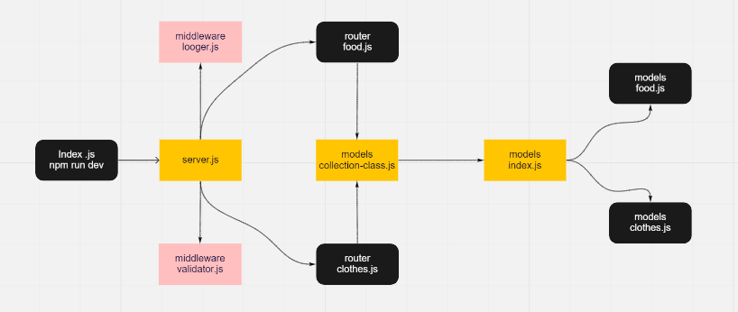

# api-server
## Setup :
- .env /PORT=3000

## Test :
- npm run test

## Running the app:
- npm run dev

## Deployment Test :
- Heroku : https://essam-api-server.herokuapp.com/
- Backend: https://github.com/essamomar93/api-server
- Pull request:  
      1. https://github.com/essamomar93/api-server/pull/2
      2. https://github.com/essamomar93/api-server/pull/3/

## Languages :
- javascript

## UML :   
- 
